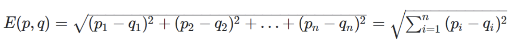
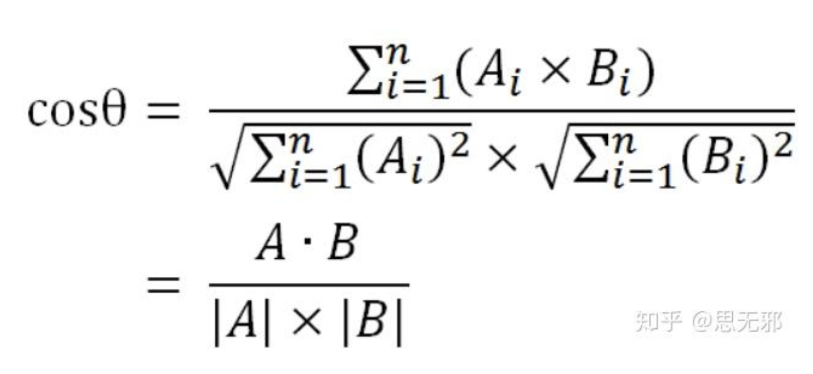
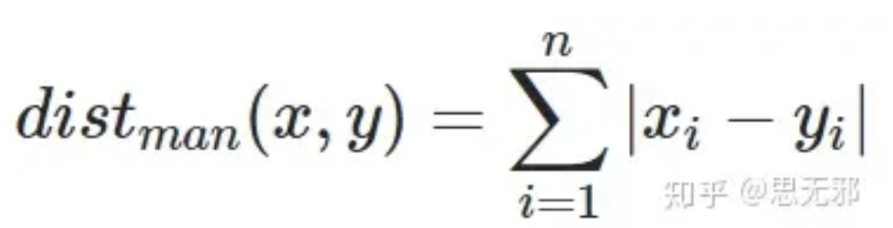
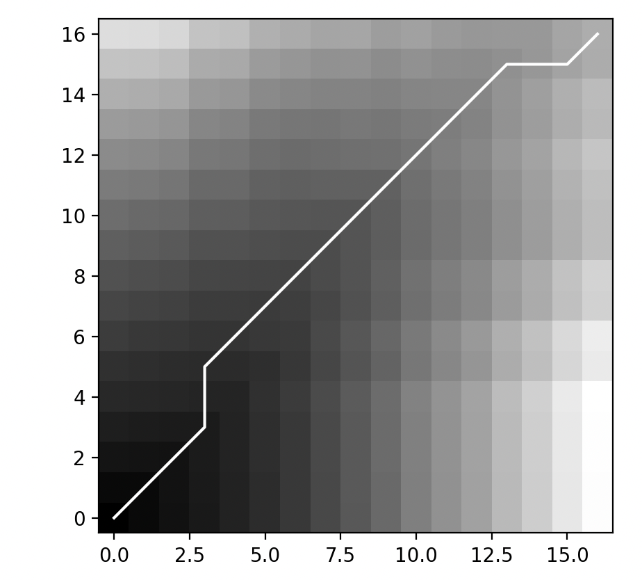

### DTW计算上传视频与标准视频的相似度

### 接口

人体关键点及球的坐标数组 like this


```
json
[{
	'flag': 1,
	'points': [
		[491.0, 770.0],
		[418.0, 828.0],
		[377.0, 821.0],
		[377.0, 937.0],
		[421.0, 1040.0],
		[456.0, 832.0],
		[447.0, 936.0],
		[436.0, 1031.0],
		[260.0, 963.0],
		[369.0, 1066.0],
		[329.0, 1199.0],
		[336.0, 966.0],
		[419.0, 1078.0],
		[346.0, 1199.0],
		[477.0, 751.0],
		[493.0, 752.0],
		[429.0, 762.0],
		[-1, -1]
	]
}]

```

### 思路

根据错误动作与标准动作之间的距离作为判断的条件，如果学生上传的视频比这个错误动作的距离还大那就判断为有错误，输出对应的错误信息。

### 度量相似度的方法

欧几里德相似度



```
python

import numpy as np
def eculidDisSim(x,y):
    '''
    欧几里得相似度
    '''
    return np.sqrt(sum(pow(a-b,2) for a,b in zip(x,y)))
if __name__=='__main__':
    a=np.array([1,2,3])
    b=np.array([6,5,4])
    sim=eculidDisSim(a,b)
```

余弦相似度



```
python
import numpy as np
def cosSim(x,y):
    '''
    余弦相似度
    '''
    tmp=np.sum(x*y)
    non=np.linalg.norm(x)*np.linalg.norm(y)
    return np.round(tmp/float(non),9)

if __name__=='__main__':
    a=np.array([1,2,3])
    b=np.array([6,5,4])
    sim=cosSim(a,b)
```

皮尔逊相似度


```
python
from scipy.stats import pearsonr
import numpy as np
def pearsonrSim(x,y):
    '''
    皮尔森相似度
    '''
    return pearsonr(x,y)[0]

if __name__=='__main__':
    a=np.array([1,2,3])
    b=np.array([6,5,4])
    sim=pearsonrSim(a,b)
```

曼哈顿相似度



```
python
import numpy as np
def manhattanDisSim(x,y):
    '''
    曼哈顿相似度
    '''
    return sum(abs(a-b) for a,b in zip(x,y))

if __name__=='__main__':
    a=np.array([1,2,3])
    b=np.array([6,5,4])
    sim=manhattanDisSim(a,b)
```

运行结果：



d = 2653.8437423706055
